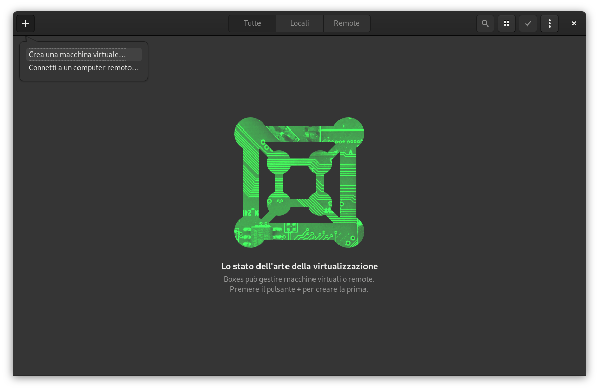
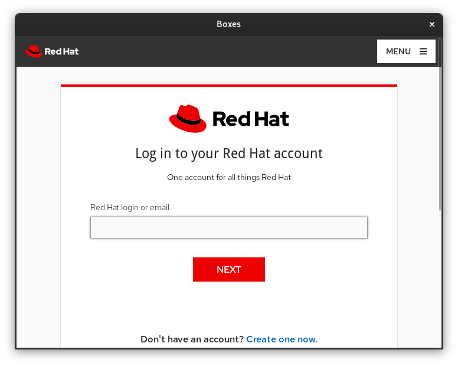
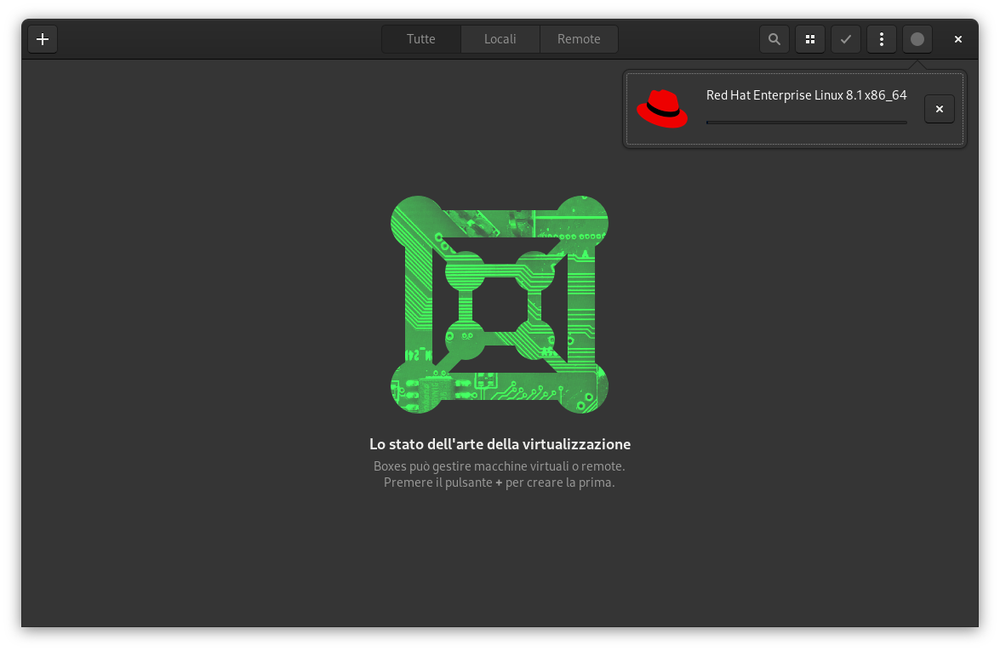
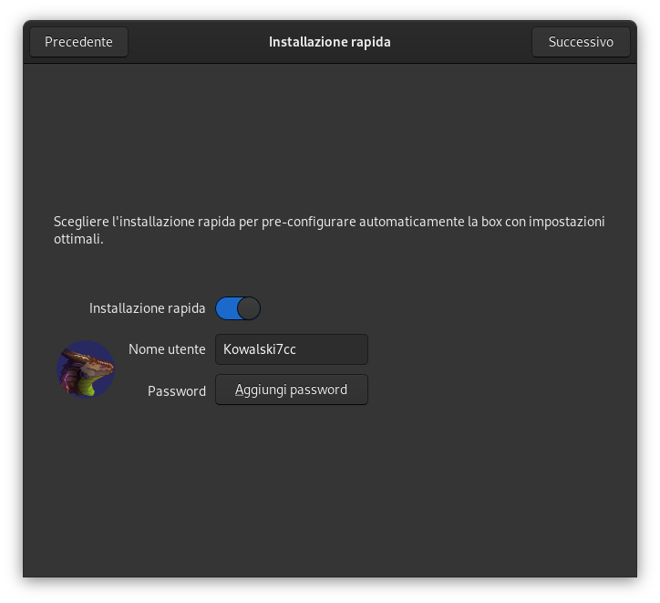
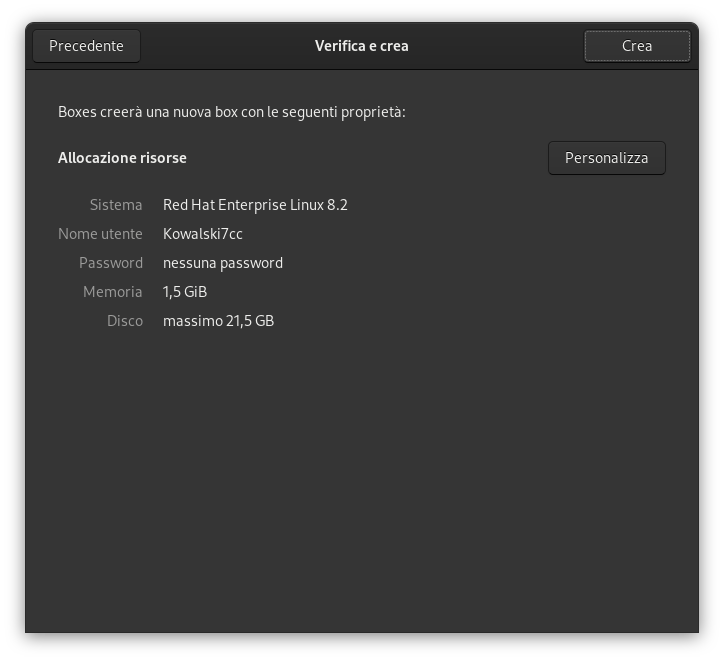
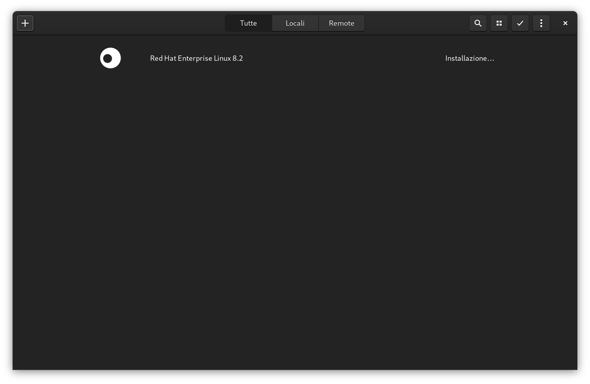
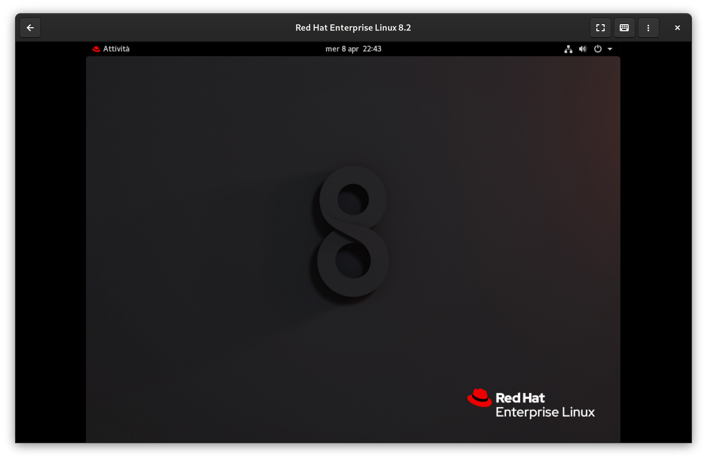

# Installazione Red Hat Enterprise Linux 8 su GNOME Boxes


Installiamo RHEL 8 mediante GNOME Boxes, un software di virtualizzazione semplificato che si basa su KVM.

## 1. Download del software

Se usate Fedora 31, probabilmente avrete già installato Boxes, altrimenti sarà sufficiente eseguire il comando

```
sudo dnf install gnome-boxes
```

Se usate invece Ubuntu, dovrete installare il programma con il comando 

```
sudo apt install gnome-boxes
```

Se preferite l'installazione mediante flatpak potete usare i seguenti comandi:

```shell
flatpak remote-add --if-not-exists flathub https://flathub.org/repo/flathub.flatpakrepo
flatpak install flathub org.gnome.Boxes
```

## 2. Download dell'immagine

Apriamo il software Boxes e premiamo il taso **+** che è presente in alto a sinistra e selezioniamo `Crea nuova macchina virtuale`:



Scorriamo l'elenco proposto fino alla sezione `In primo piano`, selezioniamo dunque `Red Hat Enterprise Linux`.


Effettua il login sul sito Red Hat (Se non hai ancora un accout o una subscription attiva, puoi scaricare comunque l'immagine registrandoti su [https://developers.redhat.com/register](https://developers.redhat.com/register))



Una volta fatto il login, la finestra si chiuderà automaticamente e vi verrà mostrata la notifica di inizio download.



## 3. Installazione del sistema

Al termine di esso, vi verrà mostrata la procedura di installazione e configurazione, che vi permetterà di preparare il sistema in pochissimo tempo.




Una volta completata la procedura, inizierà l'installazione vera e propria del sistema:



## 4. Avvio del sistema

Al termine, potrete selezionare di nuovo la voce `Red Hat` nella lista delle vostre macchine virtuali per iniziare a usare il sistema installato.


