# Ottenere una sottoscrizione Red Hat Developer

> Per gli sviluppatori non è mai stato così facile ottenere Red Hat Enterprise Linux, grazie alla disponibilità della sottoscrizione gratuita Red Hat Developer. *(Riferimento all'[articolo originale](https://developers.redhat.com/articles/getting-red-hat-developer-subscription-what-rhel-users-need-know/), in inglese)*.

Una sottoscrizione Red Hat Developer è gratuita, e necessaria per poter sfruttare appieno il software RHEL; di seguito viene illustrato come ottenerne una e come collegarla alla propria macchina virtuale.

## 1. Iscrizione a Red Hat Developer

- Unirsi al programma Red Hat Developer registrandosi a questo [link](https://developers.redhat.com/register) per ottenere una sottoscrizione. Ciascun sistema che esegue Red Hat Enterprise Linux avrà bisogno di una sottoscrizione dedicata.

**NOTA**: Se si possiede già un account aziendale sui servizi online di Red Hat, potrebbero sorgere dei problemi durante il [passo 4](#4-attivazione-della-sottoscrizione): in tal caso si consiglia di registrare comunque un account come appena spiegato, per poter godere di una sottoscrizione sviluppatore.

- Una volta aperto il link, sarà visualizzato un modulo di registrazione; scegliete uno user name da associare al vostro account, contenente almeno cinque caratteri

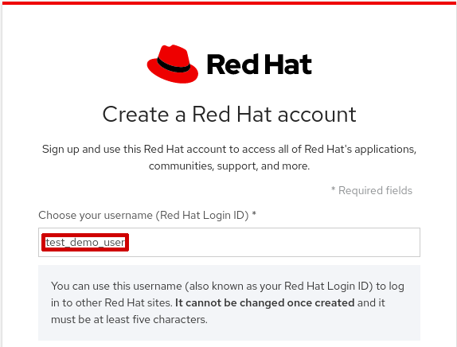

- Se lo user name scelto sarà già associato a un altro account, comparirà il seguente avviso sul campo di testo; provare con un nome differente:


- Inserire un indirizzo email valido (su di esso saranno inviate comunicazioni importanti), selezionare dal menù a tendina "Job role\*" il tipo di posizione lavorativa che si ricopre, e poi inserire una password che sia lunga almeno otto caratteri:

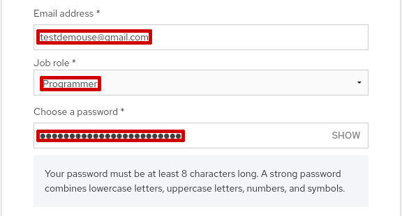

- Leggere e accettare i termini e le condizioni, e opzionalmente lasciare attiva l'ultima casella per ricevere la newsletter del programma Red Hat Developer:

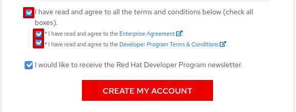

- Dopo aver compilato correttamente il modulo e aver cliccato il bottone "CREATE MY ACCOUNT", sarà visualizzato il seguente messaggio, e nel frattempo verrà inviata una email all'indirizzo usato per la registrazione:

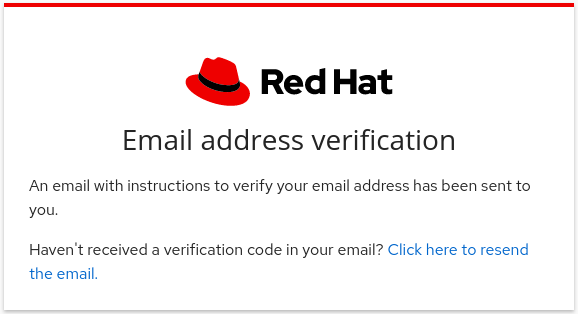

- Il messaggio di verifica dell'email avrà le seguenti caratteristiche (alcuni dati dipendono da quanto inserito nel form del passo precedente)
    - *mittente*: no-reply@redhat.com
    - *oggetto*: Red Hat Login Email Verification
    - *testo*:
    ```
    Dear Red Hat User,

    This email is sent to validate the email address you have provided for your Red Hat login and assist you in setting your Red Hat login password. Your Red Hat login, in combination with an active Red Hat subscription, provides you with access to our award-winning digital platform that delivers enterprise product knowledge, subscription resources, and technical expertise that can only come from Red Hat.

    To ensure the security of the account information associated with your Red Hat login, please take a moment to click through the link below and verify that we have the correct email address.
    This link will expire in 2 days.

    https://www.redhat.com/wapps/ugc/confirm.html?key=12345678abcdefgh
    For more information on how to access your Red Hat subscription resources, please visit: start.redhat.com.

    Thank you for using Red Hat.

    Account Information:
      Your login:         test_demo_user
      Your email address: testdemouser@gmail.com
    ```

- Cliccando sul link fornito nell'email verrà confermato l'indirizzo utilizzato durante la registrazione, e sarà possibile accedere alla sottoscrizione Red Hat Developer con le proprie credenziali di registrazione (Red Hat Login ID e password).

## 2. Installazione di RHEL

Seguendo questa [guida](../vbox-install/README.md) installare la macchina virtuale basata su Red Hat Enterprise Linux Server 8 fornita da EXTRAORDY.

## 3. Leggere e accettare le condizioni di utilizzo

- Cliccare sul seguente [link](https://www.redhat.com/wapps/tnc/standalone/ea) per visionare i termini e le condizioni di utilizzo del software.

- Se richiesto, effettuare il login con le credenziali create al [passo 1](#1-iscrizione-a-red-hat-developer)

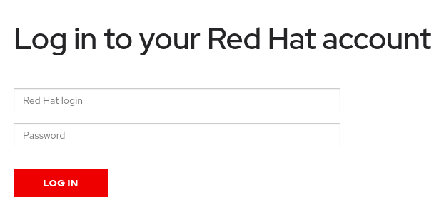

- Cliccare sulla freccia accanto a "Change agreement's location and language" per rivelare il menù a tendina, da cui cambiare la lingua del documento in Italiano:

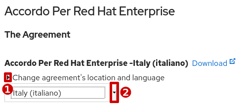

- Cliccare sul link "Download" nella pagina per scaricare il documento e leggerlo; poi cliccare sulla casella accanto a "I have read and agree to the terms" e infine sul bottone "Submit":


- Questa schermata confermerà che l'operazione sia andata a buon fine:


## 4. Attivare la sottoscrizione

Dopo l'installazione sarà necessario registrare il sistema col Red Hat Customer Portal. Questo collegherà il sistema installato alla sottoscrizione effettuata al [passo 1](#1-iscrizione-a-red-hat-developer), permettendo al sistema di scaricare software e aggiornamenti da Red Hat.

- Cliccare sul nome della macchina virtuale appena importata per selezionarla

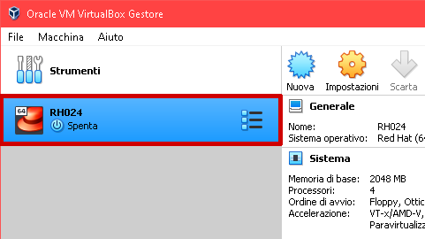

- Cliccare sul menù "Macchina" e poi sulla voce "Avvia" e infine su "Avvio normale"


- Una volta raggiunta la schermata di login, effettuate l'accesso come utente `root`, con password `redhat` (**NOTA**: anche se scriverete i caratteri della password, essi non compariranno a video; premete comunque Invio al termine dell'inserimento);

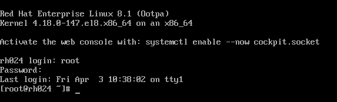

- Scrivere il seguente comando e premere Invio, sostituendo ad *EMAIL* l'indirizzo email con cui è stata effettuata l'iscrizione e a *PASSWORD* la password selezionata, durante l'iscrizione effettuata al [passo 1](#1-iscrizione-a-red-hat-developer)

```bash
subscription-manager register --username EMAIL --password PASSWORD
```

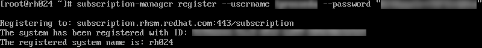

- Infine, scrivete i seguenti comandi e premete Invio:

```bash
subscription-manager refresh
subscription-manager attach --auto
```

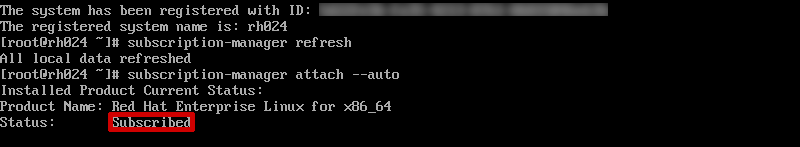

Se l'output dell'ultimo comando sarà `Status: Subscribed`, allora sarà possibile scaricare aggiornamenti e software direttamente da Red Hat.

---

Se al passo precedente si ottiene invece un errore simile a questo

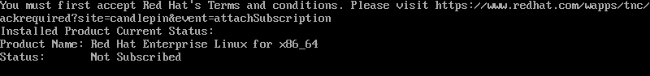

Provare ad eseguire il seguente comando (scrivere il seguente testo e premere Invio):

```bash
subscription-manager list --available
```
Se l'output è il seguente:

```bash
No available subscription pools to list
```

Allora non ci sono sottoscrizioni associate al proprio account; questo potrebbe essere dovuto alle politiche applicate ai gruppi di account aziendali, e questo caso specifico può essere risolto registrando un proprio account, come mostrato al [passo 1](#1-iscrizione-a-red-hat-developer).

---

- In caso di errore, provare ad eseguire i seguenti comandi, poi riprovare dai comandi mostrati dopo la schermata di login:

```bash
subscription-manager remove --all
subscription-manager unregister
subscription-manager clean
```

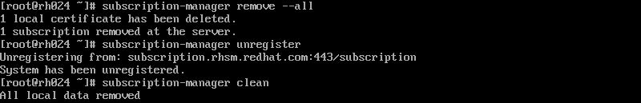
